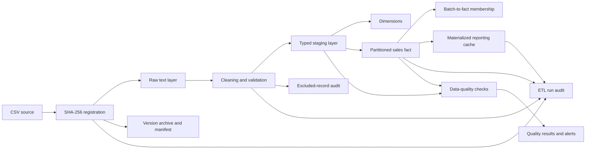
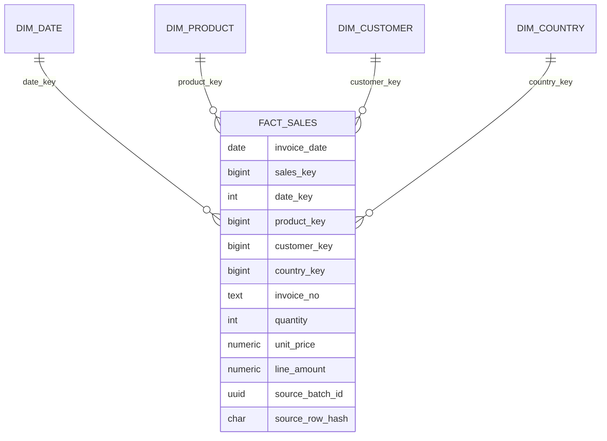

# Architecture and ETL Pipeline

## Objective

The pipeline converts the supplied Online Retail CSV into a reproducible PostgreSQL analytical warehouse. It preserves raw source values, applies deterministic validation and transformation rules, loads a star schema, records operational and data-quality audit information, archives source versions, and refreshes a materialized reporting cache.

## End-to-end flow



## Components

| Component | Responsibility |
|---|---|
| `src.ingest_raw` | Validates the CSV schema, calculates SHA-256, registers the source version, and loads source values as text. |
| `src.archive_version` | Copies the source into a dated checksum directory and writes a portable manifest. |
| `src.transform_to_staging` | Parses data types, standardizes text, detects duplicates and invalid rows, classifies transactions, and writes the typed staging table. |
| `warehouse.load_batch` | Loads dimensions, inserts canonical fact rows, and records batch membership for every accepted source row. |
| `src.check_quality` | Reconciles source, raw, staging, membership, and fact counts and stores quality results. |
| `src.refresh_cache` | Refreshes the monthly materialized reporting view and analyzes the fact table. |
| `src.run_etl` | Orchestrates stages, records run status and current stage, and emits failure alerts. |
| Windows Task Scheduler scripts | Run the complete pipeline daily, prevent overlapping executions, retry failures, and append logs. |

## PostgreSQL schemas

### `raw`

`raw.online_retail` stores one row per original CSV data row. Source business fields remain text so parsing problems do not destroy the original representation. The composite primary key is `(batch_id, source_row_number)`.

### `staging`

`staging.online_retail_clean` stores accepted, typed, and standardized invoice lines. Rejected and duplicate records are written to `audit.excluded_records` instead of being silently discarded.

### `warehouse`

The dimensional model uses:

- `warehouse.dim_date`
- `warehouse.dim_product`
- `warehouse.dim_customer`
- `warehouse.dim_country`
- `warehouse.fact_sales`

The grain of `warehouse.fact_sales` is **one accepted invoice line**. `invoice_no` is retained as a degenerate dimension. The fact table is range-partitioned by `invoice_date` into monthly partitions.



Unknown product, customer, and country members use surrogate key `0`, which preserves fact completeness and prevents null dimension foreign keys.

### `audit`

The audit schema contains:

- `audit.source_files`: source checksum, size, version, path, row count, archive location, and processing status.
- `audit.etl_runs`: pipeline run ID, current stage, final status, timings, counts, warnings, and error details.
- `audit.excluded_records`: duplicate and rejected source records with reasons and raw values.
- `audit.data_quality_results`: rule-level results for each ETL run.
- `audit.metadata_repository`: physical metadata and explicit source-to-target mappings.
- `audit.batch_fact_membership`: records that a canonical fact was present in a particular source version.

## Dataset versioning and lineage

A SHA-256 checksum identifies each unique source file. A new checksum creates a new `batch_id` and source version. The archive path is stored relative to the project root:

```text
data/archive/YYYY-MM-DD/<sha256>/online_retail.csv
```

The warehouse keeps one canonical fact for a repeated invoice line. `audit.batch_fact_membership` separately records every source batch in which that fact appeared. This avoids duplicate analytical facts while preserving multi-version lineage.

A warehouse record can be traced through:

```text
batch_fact_membership
    → fact_sales
    → staging.online_retail_clean
    → raw.online_retail
    → audit.source_files
    → archived CSV and manifest
```

## Data-quality and failure behavior

Critical reconciliation or integrity failures cause the quality stage to exit with a nonzero status. Warning thresholds are recorded without stopping the run. The orchestrator records the currently executing stage. Any unhandled pipeline-stage failure marks the ETL run as `FAILED`, stores the error message, writes application logs, writes `logs/alerts.log`, and optionally posts to the configured webhook.

## Scheduling and concurrency

`scripts/create_daily_task.ps1` registers the task. `scripts/run_etl.ps1` creates the log directory before redirection. Task Scheduler is configured to ignore a new trigger while an existing run is active and to retry a failed run up to three times at ten-minute intervals.

## Cache and performance

`reporting.monthly_sales_summary` is a materialized view used as a reporting cache. It is refreshed after a successful warehouse load and quality check. Fact indexes support invoice, customer, product, country, and date access patterns. Monthly partitioning enables partition pruning for date-restricted analytical queries.
